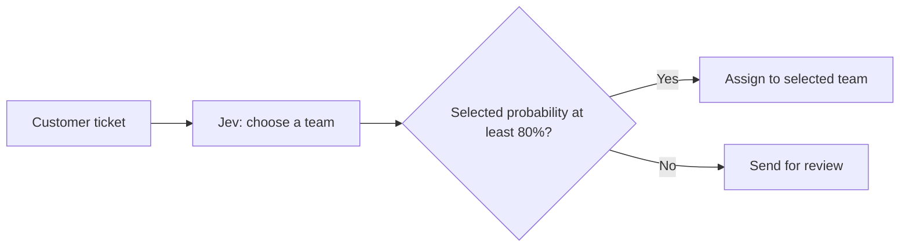
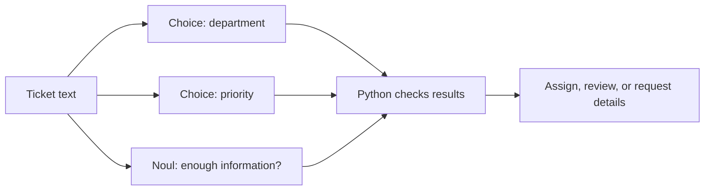

# Jev for AI developers: real use cases

## Introduction

Jev is an AI model from TypeSafe AI. It takes text and returns structured output. You provide a question and define the kind of answer you need: a yes/no probability, a category, or a score.

For example, you can ask whether a customer wants a refund, which department should receive a ticket, or how much a problem blocks someone's work. Your code reads the result and decides what to do next.

This tutorial explains the three question types, then shows them in Python, a support ticket app, and a Codex model router. The code and setup instructions are included in this repository.

## How Jev works

### Send a ticket, get a category

Suppose a customer sends this ticket:

> I was charged twice for my subscription. Please refund the duplicate payment.

We ask: **Which team should handle this ticket?** We define four possible answers:

| Answer | What it covers |
| --- | --- |
| Billing | Payments, invoices, and refunds |
| Technical | Errors and broken features |
| Product | Questions about features and how to use them |
| Other | Requests outside these categories |

Jev returns a selected answer and a probability for every option. Here is an illustrative result, not a recorded API response:

| Answer | Probability |
| --- | ---: |
| Billing | 94% |
| Technical | 2% |
| Product | 1% |
| Other | 3% |

The selected answer is Billing. Our code can route the ticket automatically if its selected probability is at least 80%. Below that threshold, it can send the ticket for review.



Jev supplies the answer and probabilities. Our application supplies the threshold, saves the ticket, and assigns the team. Classifying a refund request does not issue a refund.

### What goes into the request?

The API uses three terms:

| Term | Meaning | In this example |
| --- | --- | --- |
| State | The text or structured text data to evaluate | The ticket title and message |
| Instructions | The question to answer | Which team should handle this ticket? |
| Criteria | Descriptions of the options or levels | Billing covers payments, invoices, and refunds |

A request also specifies the model and a name for each question so your code can find its answer. Noul questions do not need a list of criteria.

Supply the information needed to answer the question. A ticket that says "It still doesn't work" may need earlier messages or reproduction steps. Jev only evaluates the state you send; it does not fetch those details for you. See the [TypeSafe introduction](https://docs.typesafe.ai/introduction).

### Choose the answer type

| Type | Question | Returned value |
| --- | --- | --- |
| Noul | Does the customer explicitly request a refund? | A yes probability, such as `0.92` |
| Choice | Which team should handle this ticket? | One category, plus probabilities for every option |
| Score | How much does the issue block work? | A numeric score, plus probabilities for each defined level |

**Noul returns a number, not a Boolean.** An illustrative value of `0.92` means an estimated 92% probability of yes. Your code could accept values above 0.9, reject values below 0.1, and review everything between. These cutoffs are your rules. See [Noul](https://docs.typesafe.ai/primitives/noul).

**Choice selects one option.** For the Billing example, code reads the selected label and then looks up that label's probability:

```python
answer = response.choices["department"]
department = answer.choice
probability = answer.probabilities[department]
```

`department` is the question name chosen for this example. Each category needs a clear description. "Other" means the request falls outside the named categories; it does not mean the model is unsure. See [Choice](https://docs.typesafe.ai/primitives/choice).

**Score uses an ordered scale.** For work impact, we can define:

| Level | Description |
| --- | --- |
| 0 | Work can continue without a workaround |
| 1 | Work can continue with a workaround |
| 2 | Work is blocked and there is no workaround |

With illustrative probabilities of 10%, 60%, and 30%, the score is:

```text
(0 × 0.10) + (1 × 0.60) + (2 × 0.30) = 1.2
```

This is a weighted average of the level numbers. It is not a percentage of users affected. A score of 1 could mean all probability is on level 1, or half is on level 0 and half on level 2. Inspect the probabilities alongside the score. See [Score](https://docs.typesafe.ai/primitives/score).

Use Choice when you need one named category. Use Score when a position on a defined scale is useful, for example when ranking reports by work impact.

### Ask one thing per question

"What should we do with this ticket?" mixes several decisions. Split it into questions your code can use:

- Which department should handle it?
- What priority does it deserve?
- Does it contain enough information to investigate?

You can mix question types in one request. Each question reads the same state independently. It does not see the other questions' answers.



If a later question needs an earlier answer, make another request with that answer included in the state. TypeSafe recommends asking specific questions and combining their results in code. See [the introduction](https://docs.typesafe.ai/introduction).

Write criteria that separate the answers. In a tech company, IT Support might handle employee devices and access, while Engineering handles bugs in the company's product. An engineer asking for GitHub access should go to IT Support. The word "engineer" alone should not determine the department.

### Use probabilities to decide when to review

A label tells us where a ticket might belong. Its probability helps us decide whether to assign it automatically.

Our demo uses an 80% selected-probability threshold. That is a starting setting, not a measured guarantee. Raising it generally sends more tickets for review. Test whether the tickets you still accept automatically are classified accurately enough.

Choice and Score also return `confidence`. This is a statistic derived from how the probabilities are distributed. It is a separate value from the selected option's probability. Our demos use the selected probability for their review rules. See [confidence](https://docs.typesafe.ai/confidence).

TypeSafe calls its training approach Reinforcement Learning for Calibrated Decisions, or RLCD. Calibration means that, across comparable predictions, answers assigned about 80% probability should be correct about 80% of the time. You need many labeled examples to check that. One confident answer can still be wrong. See the [TypeSafe AI primer](https://docs.typesafe.ai/introduction/machine-learning-primer).

### When should you use Jev?

| Need | Approach to consider |
| --- | --- |
| Check whether an invoice is past its due date | Ordinary code comparing dates |
| Decide whether an email disputes an invoice | Jev interpreting the message against defined criteria |
| Investigate the dispute and draft a reply | A language model with the necessary information and tools |

A general-purpose language model can also classify text and return structured output. Jev provides an API built around these question types and their probabilities. Compare accuracy, response time, and total cost on the same examples before choosing it.

TypeSafe calls Jev a System One model, borrowing the name for fast thinking from *Thinking, Fast and Slow*. A reasoning model can do the longer investigation after Jev routes the request. This describes their roles in the workflow; it does not mean they think like people.

Jev does not write replies, generate code, or explain its reasoning. Its current API accepts text and structured text data, not images, audio, or video. Your application still needs permissions, business rules, and handling for failed API calls. See [System One](https://docs.typesafe.ai/concepts/system-one).

## Demo: Python question types

Three short files show real API calls using invented tickets:

| Example | What it demonstrates |
| --- | --- |
| [01-noul.py](../src/01-noul.py) | Detect an explicit refund request and use its probability to choose the next step |
| [02-choice.py](../src/02-choice.py) | Select billing, technical, product, or other; review results below 80% |
| [03-score.py](../src/03-score.py) | Score work impact using normal work, a workaround, and blocked work as levels |

The [README](../README.md#run-the-python-examples) covers uv setup and the TypeSafe API key. These examples call the hosted API.

## Demo: support ticket app

The [support app](../demos/support-desk/README.md) uses Python, React, and SQLite. Creating a ticket automatically asks two Choice questions: department and priority.

Departments are HR, Finance, Engineering, IT Support, and Other. Priorities are Low, Normal, High, and Critical. The queue shows both labels and their selected probabilities. If either probability is below 80%, the ticket needs review.

Compare an employee who cannot access GitHub with a production outage affecting customers. The app saves tickets before classification, so an API failure leaves the ticket available for retry.

## Demo: Codex model router

The [Codex router skill](../demos/codex-router/README.md) uses Jev to classify a task as routine, standard, or complex. Python maps the category to a configured model and reasoning level. Codex opens a new task with that model and a complete brief.

The demo asks for a read-only explanation of the Choice example. It shows the classification probability, selected model, and new task. Low probability or an API failure selects the configured complex route.

This selects from a model mapping you control; it does not prove which model is cheapest or will succeed. Creating the new task requires Codex desktop tools. The Python classifier also runs in a terminal.

## Summary

To try Jev in your own application, choose one question and describe its possible answers. Collect examples with known results, including ambiguous and incomplete inputs.

Measure incorrect automatic decisions, how often review is needed, response time, and cost. If you change the criteria or threshold, check the result on separate examples. Those measurements tell you whether Jev is useful for your application.
