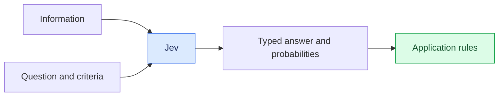
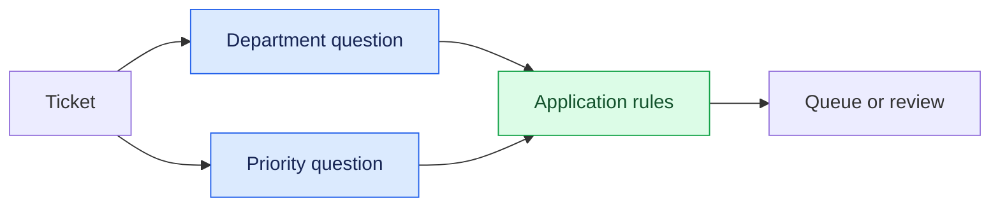
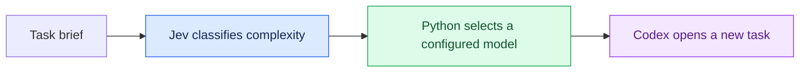

# Jev for AI developers: real use cases

## Introduction

Jev is a model from TypeSafe AI for making decisions that software can use. Give it information and a focused question, and it returns a typed answer with probabilities.

This tutorial covers what Jev does, its three question types, and two applications: a support ticket queue and a Codex model router. The Python examples, app, and skill are included in this repository.

## What Jev is and why it matters

### Decisions inside software

Applications often need to interpret language before choosing a next step. A support ticket needs a department. A customer message may contain a refund request. A coding task may need a more capable model.

Jev evaluates these questions using the information and answer definitions you supply. Your code uses the results to route work, rank items, or ask for review.

A regular language model can also classify text and return structured output. Jev's API is built around focused decisions. The reason to consider it is whether its answers, cost, and response time suit your workload. See the [TypeSafe introduction](https://docs.typesafe.ai/introduction).

### System One and System Two

TypeSafe uses the name System One for fast, focused judgments. The name refers to the distinction between quick, intuitive thinking and slower, deliberate thinking popularized in *Thinking, Fast and Slow*.

In a software workflow, these roles can complement each other. One model classifies the work; another investigates the problem or produces a response. This is an analogy for their roles, not a claim that models think like people. See [System One](https://docs.typesafe.ai/concepts/system-one).

| Role | Example |
| --- | --- |
| Focused judgment | Decide which department should receive a ticket |
| Reasoning and generation | Investigate the issue and write a response |
| Application logic | Check permissions, save the result, and assign the ticket |

### Training for decisions

TypeSafe describes its training approach as Reinforcement Learning for Calibrated Decisions, or RLCD. Its aim is to produce useful decisions and probabilities that reflect how often those decisions are correct.

Calibration describes groups of predictions. For a well-calibrated model, outcomes assigned about 80% probability should occur about 80% of the time across comparable cases. That does not guarantee any individual answer, and it needs to be checked on the data your application handles. See the [TypeSafe AI primer](https://docs.typesafe.ai/introduction/machine-learning-primer).

### State, questions, and answer types

The API calls the information being evaluated the **state**. It can contain text or structured text data, such as a ticket's title and message.

A **question** describes the judgment to make. Its instructions and criteria define what the answer means.

| Type | Use it to ask | Example |
| --- | --- | --- |
| Noul | Is this statement true? | Does the customer explicitly request a refund? |
| Choice | Which option fits? | Which department should handle this ticket? |
| Score | Where does this fit on an ordered scale? | How much does the issue block someone's work? |

Noul returns the estimated probability of yes. Choice returns an option and a distribution across the options. Score returns a position on a scale and a distribution across its levels. Choice and Score also include a confidence statistic. See [Noul](https://docs.typesafe.ai/primitives/noul), [Choice](https://docs.typesafe.ai/primitives/choice), and [Score](https://docs.typesafe.ai/primitives/score).

### Ask small questions and combine the results

Several questions can be evaluated in one request. Each reads the same state independently. One question does not receive another question's answer.

For a support ticket, department and priority are separate judgments. Your code combines them to decide where the ticket appears. If a later question needs an earlier answer, use a separate call with that answer included in its state.

Clear criteria matter. Engineering might own the company's production systems, while IT Support owns employee access and devices. Mentioning a developer tool should not decide the department on its own.

### Probability, confidence, and review

For Choice, the selected probability is the probability assigned to the chosen option. The separate `confidence` field summarizes how concentrated the whole distribution is. Our demos use the selected probability for their thresholds.

A review threshold is an application rule. It should depend on the consequences of a mistake and the results you observe on representative examples. A confident answer can still be wrong, and a vague message does not always produce low probability. See [TypeSafe confidence](https://docs.typesafe.ai/confidence).

### What Jev does not do

Jev does not write replies, generate code, or explain its reasoning. Its current API accepts text input, including structured text data; it does not accept images, audio, or video. See [System One](https://docs.typesafe.ai/concepts/system-one).

A typed answer does not prove that the decision is correct. Detecting a refund request does not establish that a refund is allowed. The application still needs policy checks, permissions, and error handling.

## Demo: Python question types

Three small files show the request and response for each type. They use the TypeSafe Python SDK and real API calls with invented tickets.

| Example | What it demonstrates |
| --- | --- |
| [01-noul.py](../src/01-noul.py) | Detect an explicit refund request and use its probability to choose a next step |
| [02-choice.py](../src/02-choice.py) | Select billing, technical, product, or other; flag a selected probability below 0.8 for review |
| [03-score.py](../src/03-score.py) | Assess whether work can continue normally, needs a workaround, or is blocked |

Different probability distributions can produce the same score. Read the probabilities alongside the result.

Setup and run commands are in the [repository README](../README.md#run-the-python-examples).

## Demo: support ticket app

The [support app](../demos/support-desk/README.md) is a Python and React application with SQLite storage. Creating a ticket automatically asks Jev two Choice questions: which department should receive it, and what priority it deserves.

Departments are HR, Finance, Engineering, IT Support, and Other. Priorities are Low, Normal, High, and Critical. The queue shows each selected label and its probability. If either probability is below 80%, the ticket appears in Needs review.

An employee blocked from accessing GitHub and a production outage affecting customers show why department and priority need clear definitions. Other is a category for requests outside the named departments; it is separate from uncertainty.

Tickets are saved before classification. If the API call fails, the message remains available for retry. The app classifies requests but does not carry out business actions.

## Demo: Codex model router

The [Codex router skill](../demos/codex-router/README.md) classifies a task as routine, standard, or complex. A Python script maps that class to a configured model and reasoning level. Codex then creates a new task with a complete brief.

The demo asks for a read-only explanation of the Choice example. It shows the selected model, classification probability, and the new task that performs the work.

Low probability or an API failure selects the configured complex route. The model mapping can be changed to match the account's available models. This is a routing heuristic, not proof that the selected model is the cheapest or will complete the task successfully.

The full skill requires Codex desktop task-creation tools. It opens a separate conversation rather than changing the model in the current one. The Python classifier also runs on its own in a terminal.

## Summary

Jev provides focused judgments that can be used in ordinary application logic. Noul answers a yes-or-no question, Choice selects a category, and Score places an input on an ordered scale.

The support app uses those judgments to organize work. The Codex skill uses them to select a model for a new task. In both cases, code defines the allowed actions and handles uncertain or failed results.

To apply the same pattern, choose one decision in your own workflow. Write clear criteria, collect examples with expected answers, and check both the decisions and their probabilities. Measure the full workflow before making claims about reliability, speed, or savings.
