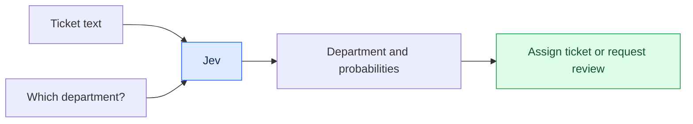
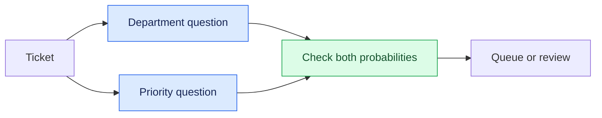
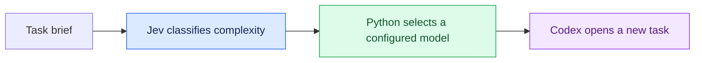

# Jev for AI developers: real use cases

## Introduction

Jev is a new type of AI model from TypeSafe AI. It takes text and returns structured output. You provide a question and define the possible answers. Jev returns an answer and probabilities that your code can use.

This tutorial covers what Jev does, its three question types, and two applications: a support ticket queue and a Codex model router. The Python examples, app, and skill are included in this repository.

## How Jev works

### Text in, structured output out

For example, you can give Jev a support ticket and ask which department should handle it. You define the departments and describe what each one handles.

Jev returns a department and a probability for each option. Your code can assign the ticket to that department or flag it for review.

A regular language model can also classify text and return structured output. Jev is designed specifically for this kind of task. Compare its accuracy, cost, and response time on your own examples before choosing it. See the [TypeSafe introduction](https://docs.typesafe.ai/introduction).

### System One and System Two

TypeSafe calls Jev a System One model because it is designed to answer specific questions quickly. The name refers to the distinction between quick, intuitive thinking and slower, deliberate thinking popularized in *Thinking, Fast and Slow*.

You can use Jev to choose a support department, then use a language model to draft a reply. The comparison with human thinking explains the name; it does not mean the models think like people. See [System One](https://docs.typesafe.ai/concepts/system-one).

| Part of the application | Example |
| --- | --- |
| Jev | Decide which department should receive a ticket |
| Language model | Investigate the issue and write a response |
| Your code | Check permissions, save the result, and assign the ticket |

### How Jev is trained

TypeSafe describes its training approach as Reinforcement Learning for Calibrated Decisions, or RLCD. The aim is to train the model to answer correctly and estimate how likely each answer is.

If a model assigns 80% probability to many answers, about 80% of those answers should be correct. This is what calibration means. You need many examples to check it. One answer with an 80% probability does not tell you whether the model is well calibrated. See the [TypeSafe AI primer](https://docs.typesafe.ai/introduction/machine-learning-primer).

### What you send to the API

The **state** is the text you want Jev to read. It can be a message or structured data containing text, such as a ticket title and description.

A **question** tells Jev what to answer. For Choice and Score, you also supply **criteria**: descriptions of the options or levels it can choose from.

| Type | Use it to ask | Example |
| --- | --- | --- |
| Noul | Is this statement true? | Does the customer explicitly request a refund? |
| Choice | Which option fits? | Which department should handle this ticket? |
| Score | Where does this fit on an ordered scale? | How much does the issue block someone's work? |

Noul returns the estimated probability of yes. Choice returns one option and a probability for each option. Score returns a number on your scale and a probability for each level. Choice and Score also return a confidence value. See [Noul](https://docs.typesafe.ai/primitives/noul), [Choice](https://docs.typesafe.ai/primitives/choice), and [Score](https://docs.typesafe.ai/primitives/score).

### Ask several questions in one request

You can send several questions in one API request. Each question is answered using the same input. The questions do not see each other's answers.

For a support ticket, you can ask for the department and priority together. Your code uses both answers to place the ticket in a queue. If a question needs a previous answer, make another API call and include that answer in the input.

Describe what each department handles. For example, Engineering handles problems with the company's product. IT Support handles employee devices and access. A request for GitHub access should go to IT Support, even if the employee is an engineer.

### Probability, confidence, and review

If Jev chooses Finance, its selected probability is the probability assigned to Finance. The separate `confidence` value describes whether the probabilities favour one answer or are spread across several. Our demos check the selected probability when deciding whether a result needs review.

A threshold sets the minimum probability your code will accept without review. Choose it by testing examples and considering what happens when the answer is wrong. The model can still give a wrong answer a high probability. See [TypeSafe confidence](https://docs.typesafe.ai/confidence).

### What Jev does not do

Jev does not write replies, generate code, or explain its reasoning. Its current API accepts text input, including structured text data; it does not accept images, audio, or video. See [System One](https://docs.typesafe.ai/concepts/system-one).

An answer can have the correct format and still be wrong. A customer asking for a refund may not be eligible for one. Your code still needs to check the refund policy and handle API failures.

## Demo: Python question types

Three small files show the request and response for each type. They use the TypeSafe Python SDK and real API calls with invented tickets.

| Example | What it demonstrates |
| --- | --- |
| [01-noul.py](../src/01-noul.py) | Detect an explicit refund request and use its probability to choose a next step |
| [02-choice.py](../src/02-choice.py) | Select billing, technical, product, or other; flag a selected probability below 0.8 for review |
| [03-score.py](../src/03-score.py) | Assess whether work can continue normally, needs a workaround, or is blocked |

The same score can come from different probabilities. Check the probabilities as well as the score.

Setup and run commands are in the [repository README](../README.md#run-the-python-examples).

## Demo: support ticket app

The [support app](../demos/support-desk/README.md) is a Python and React application with SQLite storage. Creating a ticket automatically asks Jev two Choice questions: which department should receive it, and what priority it deserves.

Departments are HR, Finance, Engineering, IT Support, and Other. Priorities are Low, Normal, High, and Critical. The queue shows each selected label and its probability. If either probability is below 80%, the ticket appears in Needs review.

The demo compares an employee who cannot access GitHub with a production outage affecting customers. Other means a request falls outside the named departments. It does not mean the model is unsure.

Tickets are saved before classification. If the API call fails, the message remains available for retry. The app does not issue payments or change employee access.

## Demo: Codex model router

The [Codex router skill](../demos/codex-router/README.md) classifies a task as routine, standard, or complex. A Python script looks up the model and reasoning level configured for that category. Codex creates a new task with the instructions needed to do the work.

The demo asks for a read-only explanation of the Choice example. It shows the selected model, classification probability, and the new task that performs the work.

If the selected probability is low or the Jev call fails, the script uses the model configured for complex tasks. You can change the model choices to match your account. The selected model is not guaranteed to be the cheapest or to complete the task.

The full skill requires Codex desktop task-creation tools. It opens a separate conversation rather than changing the model in the current one. The Python classifier also runs on its own in a terminal.

## Summary

Jev takes text and returns structured answers with probabilities. Noul returns the probability of yes, Choice selects a category, and Score returns a number on a scale you define.

The support app assigns departments and priorities. The Codex skill chooses a model and opens a new task. In both examples, code decides what to do with the answer and what happens if the API call fails.

Start with one question your application needs to answer. Describe the possible answers and test examples where you know the correct result. Check accuracy, response time, and total cost before relying on it.
